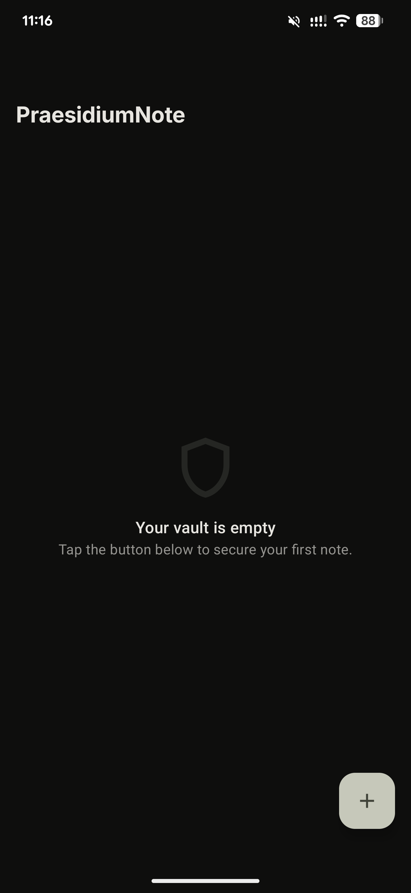
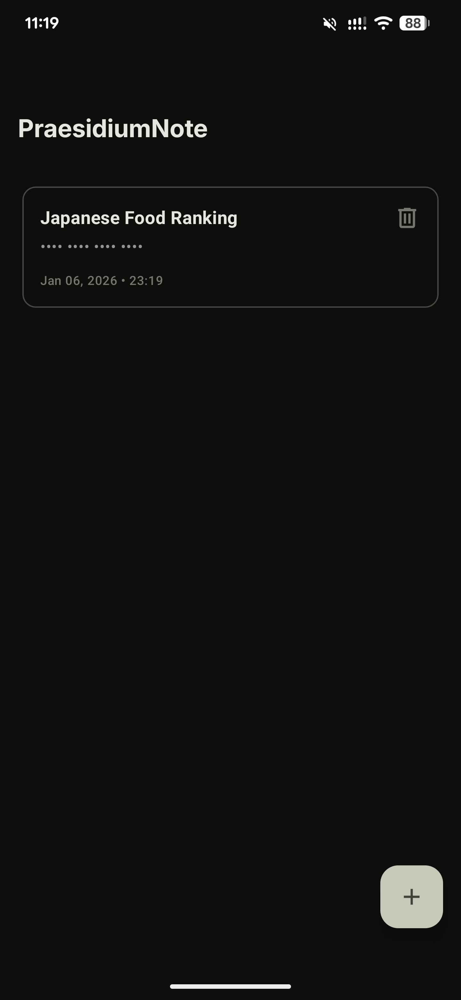
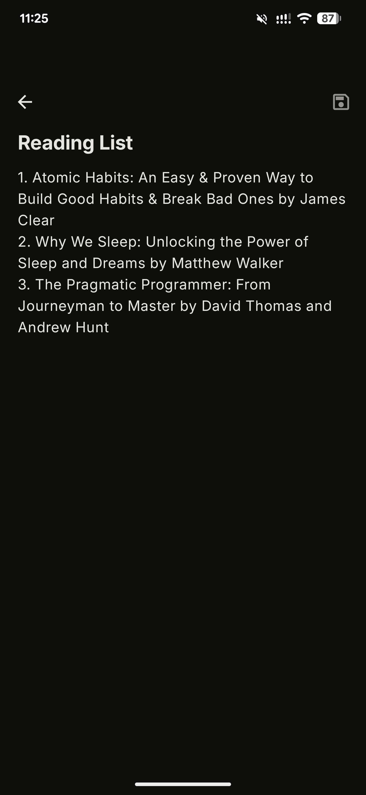
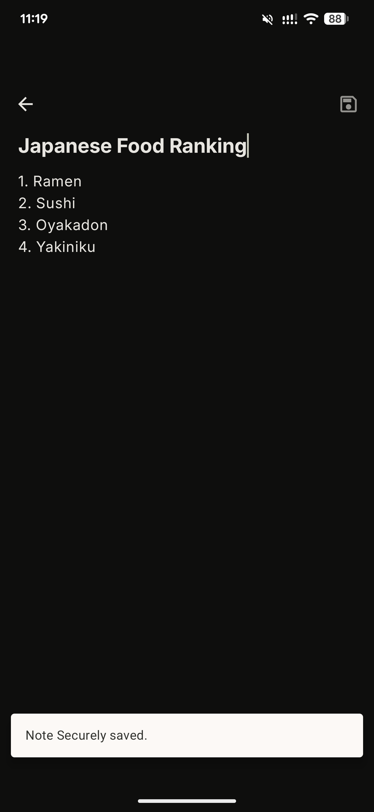
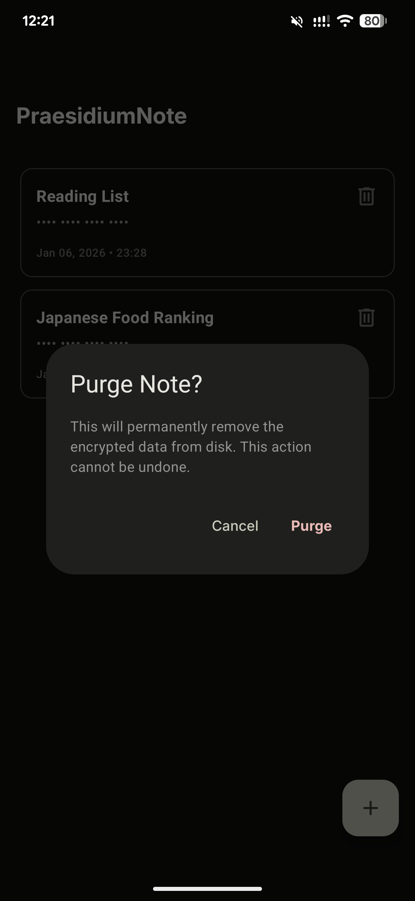

# 🛡️ Praesidium Note

**Praesidium Note** is a high-security, zero-knowledge digital vault for Android. Designed for users who prioritize privacy, it leverages hardware-backed encryption and strict memory management to ensure sensitive data never leaves the device in a readable format.

## 📸 Screenshots

### Dark Mode

| Vault Dashboard (Empty)  | Vault Dashboard (with Notes)  | Secure Editor | Vault Deletion |
| ------------------------ | ----------------------------- | ------------- | -------------- |
|  |   |   |   |

## 🚀 Key Features

- **Zero-Knowledge Architecture:** Data is encrypted locally; the developer never sees your content.

- **Biometric Security:** Seamless integration with Android BiometricPrompt (Fingerprint/Face).

- **Hardware-Backed Encryption:** Keys are generated and stored inside the device's Secure Element (TEE/StrongBox).

- **Anti-Memory Scraping:** Defensive coding patterns (using `CharArray`) to wipe data from the Java Heap.

## 🏗️ Technical Architecture

Following the [Now in Android](https://github.com/android/nowinandroid "Now In Android") philosophy, this project utilizes **Clean Architecture** with a layered approach to separate concerns and maximize testability.

### Layer Breakdown

- **`:app`**: The entry point, containing `MainActivity` and global Hilt configuration.

- **`:presentation`**: Jetpack Compose UI, MVI/MVVM ViewModels, and UI state management.

- **`:domain`**: The "Brain." Contains pure Kotlin Business Logic, UseCases, and Repository interfaces. **No Android dependencies.**

- **`:data`**: Implementation of repositories, SQLCipher database (Room), and `AndroidKeyStore` interaction.

### Security Stack

- **SQLCipher:** AES-256 GCM encryption at the SQLite level.

- **Conscrypt/KeyStore:** Utilizing the best available security provider for key generation.

- **Heap Hygiene:** Manual zeroing of `CharArray` to prevent sensitive data from lingering in the String Pool.

## 🛠️ Development Setup

1. Clone the repository.

2. Ensure you have the latest **Android Studio (Otter or later)**.

3. The project uses **Hilt** for DI; if you see generated code errors, run `./gradlew assembleDebug`.

4. **Note on Emulators:** If the emulator does not support hardware-backed Keystore, the app uses a deterministic fallback key for development purposes.

## 📄 License

Praesidium Note is compliant with Apache License 2.0. See [LICENSE](https://github.com/miggymamba/PraesidiumNote/blob/main/LICENSE) for more information.