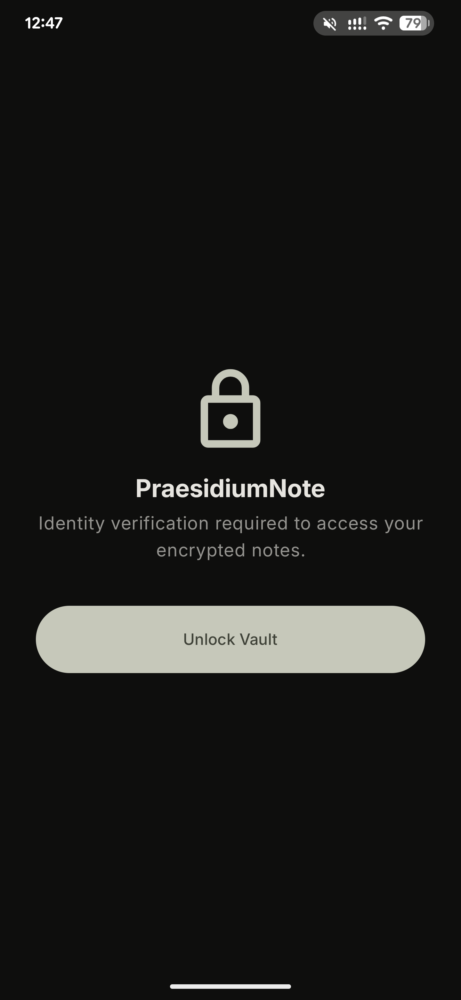
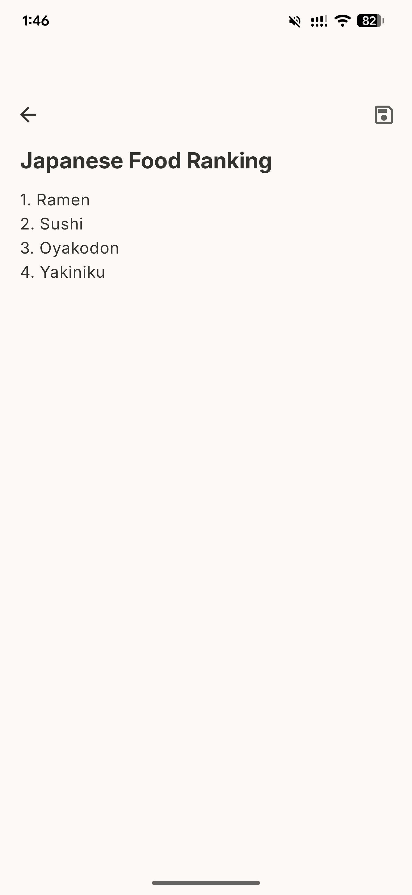
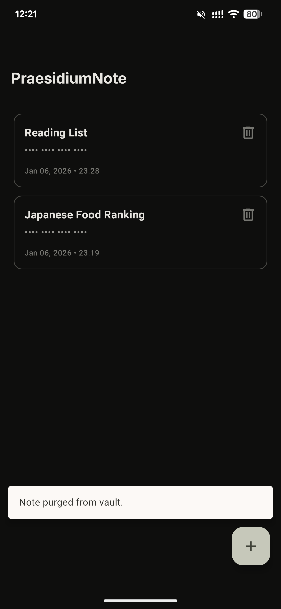
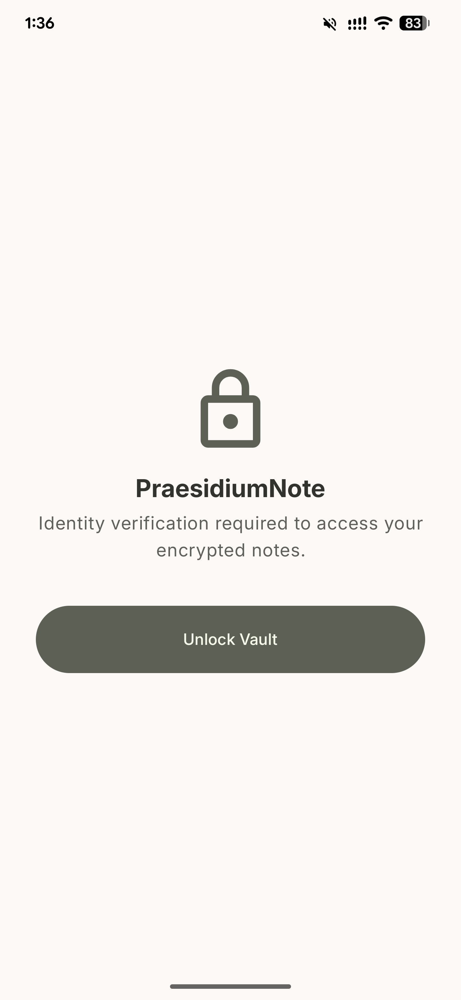
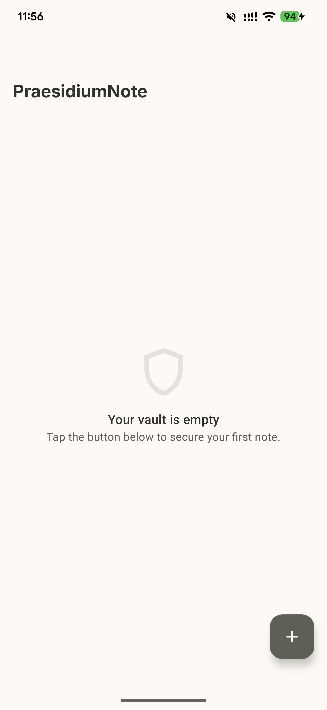
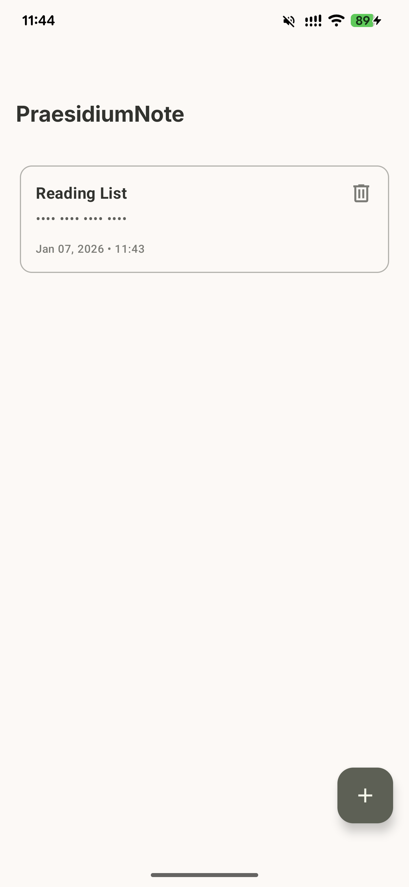
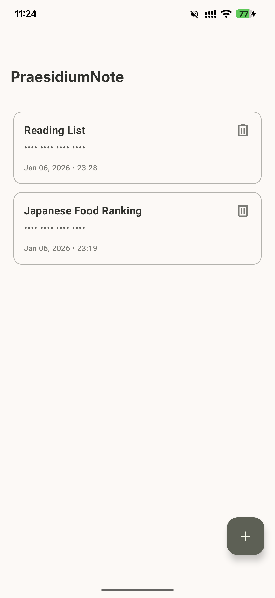
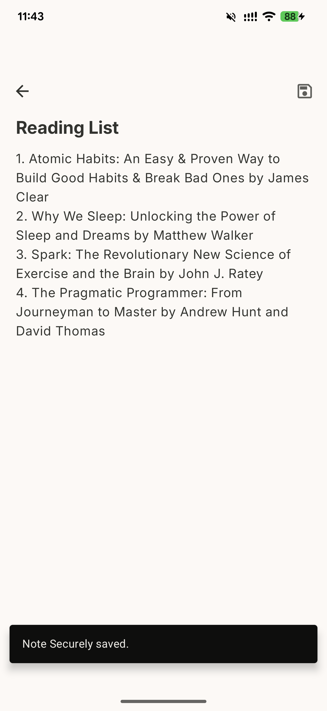
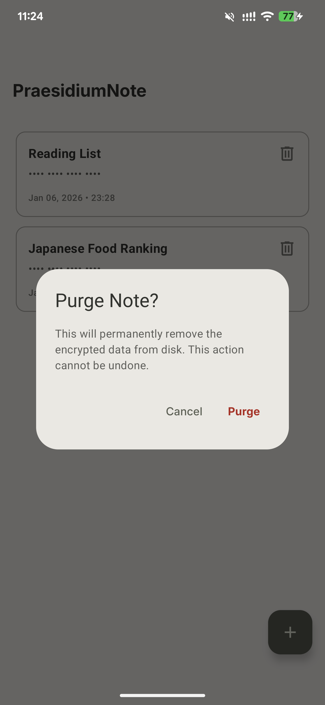
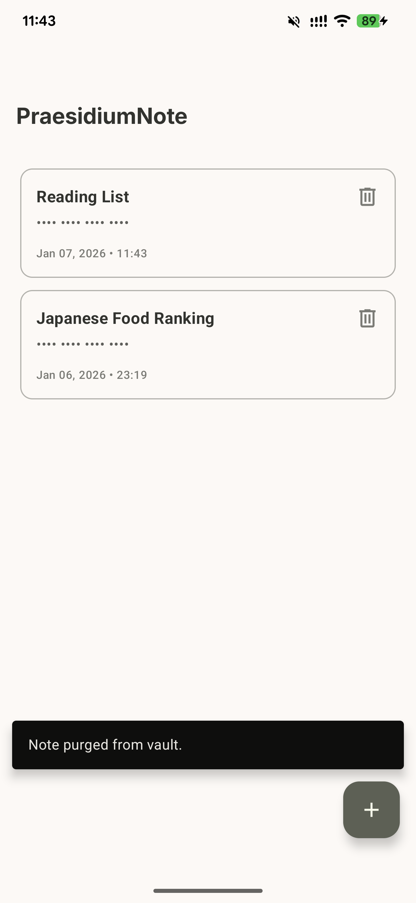

# 🛡️ Praesidium Note

**Praesidium Note** is a high-security, zero-knowledge digital vault for Android. Designed for users who prioritize privacy, it leverages hardware-backed encryption and strict memory management to ensure sensitive data never leaves the device in a readable format.

## 🚀 Key Features

- **Zero-Knowledge Architecture:** Data is encrypted locally; the developer never sees your content.

- **Biometric Security:** Seamless integration with Android BiometricPrompt (Fingerprint/Face).

- **Hardware-Backed Encryption:** Keys are generated and stored inside the device's Secure Element (TEE/StrongBox).

- **Anti-Memory Scraping:** Defensive coding patterns (using `CharArray`) to wipe data from the Java Heap.

## 🏗️ Technical Architecture

Following the [Now in Android](https://github.com/android/nowinandroid "Now In Android") philosophy, this project utilizes **Clean Architecture** with a layered approach to separate concerns and maximize testability.

### Layer Breakdown

- **`:app`**: The entry point, containing `MainActivity` and global Hilt configuration.

- **`:presentation`**: Jetpack Compose UI, MVI/MVVM ViewModels, and UI state management.

- **`:domain`**: The "Brain." Contains pure Kotlin Business Logic, UseCases, and Repository interfaces. **No Android dependencies.**

- **`:data`**: Implementation of repositories, SQLCipher database (Room), and `AndroidKeyStore` interaction.


### Security Stack

- **SQLCipher:** AES-256 GCM encryption at the SQLite level.

- **Conscrypt/KeyStore:** Utilizing the best available security provider for key generation.

- **Heap Hygiene:** Manual zeroing of `CharArray` to prevent sensitive data from lingering in the String Pool.


## 🛠️ Development Setup

1. Clone the repository.

2. Ensure you have the latest **Android Studio (Otter or later)**.

3. The project uses **Hilt** for DI; if you see generated code errors, run `./gradlew assembleDebug`.

4. **Note on Emulators:** If the emulator does not support hardware-backed Keystore, the app uses a deterministic fallback key for development purposes.

## Sequence Diagram

````mermaid
sequenceDiagram
    autonumber
    participant UI as UI Layer (Compose)
    participant VM as ViewModel (State)
    participant UC as Use Case (Domain)
    participant REPO as Repository (Data)
    participant SEC as Security/Biometrics
    participant DB as Room Database

    Note over UI, DB: [PHASE 1: AUTHENTICATION GATE]
    
    UI->>VM: Check Auth Status
    VM->>UC: AuthenticateUser()
    UC->>REPO: validateSession()
    REPO->>SEC: promptBiometric()
    activate SEC
    Note right of SEC: System Biometric Prompt
    SEC-->>REPO: Success (SecretKey unlocked)
    deactivate SEC
    REPO-->>UC: AuthResult.Success
    UC-->>VM: State: Authenticated
    VM-->>UI: Navigate to NoteList

    Note over UI, DB: [PHASE 2: NOTE RETRIEVAL]

    UI->>VM: Load Notes
    activate VM
    VM->>UC: GetNotes()
    activate UC
    UC->>REPO: fetchEncryptedNotes()
    activate REPO
    REPO->>DB: queryAll()
    activate DB
    DB-->>REPO: List<NoteEntity> (Encrypted)
    deactivate DB
    
    loop Decryption per Note
        REPO->>SEC: decrypt(payload)
        SEC-->>REPO: Plaintext (CharArray)
    end
    
    REPO-->>UC: List<Note>
    deactivate REPO
    UC-->>VM: Result<List<Note>>
    deactivate UC
    VM-->>UI: Update LazyColumn State
    deactivate VM

    Note over UI, DB: [PHASE 3: SAVE NOTE (ZERO-KNOWLEDGE)]
    
    UI->>VM: saveNote(title, content)
    activate VM
    VM->>VM: Set isLoading = true
    
    Note right of VM: String converted to CharArray<br/>Secure memory handling
    
    VM->>UC: SaveNote(note)
    activate UC
    
    Note over UC: Business Rule Validation
    
    UC->>REPO: persistNote(note)
    activate REPO
    
    REPO->>SEC: encrypt(note.content)
    activate SEC
    Note right of SEC: AES-GCM Encryption
    SEC-->>REPO: EncryptedPayload (IV + Ciphertext)
    deactivate SEC
    
    REPO->>DB: insert(NoteEntity)
    activate DB
    DB-->>REPO: Success
    deactivate DB
    
    REPO-->>UC: Result.Success
    deactivate REPO
    UC-->>VM: Result.Success
    deactivate UC
    
    alt On Success
        VM->>VM: Set isSaved = true
        VM->>UI: Trigger Navigation Back
    else On Failure
        VM->>VM: Set error state
        VM->>UI: Show Snackbar
    end
    
    Note over VM: wipeLocalCharArrays()
    deactivate VM
````

## 📸 Screenshots

### Dark Mode

| Screen Name | Images |
| ----------- | ------ |
| **Vault Gate** |  |
| **Vault Dashboard (Empty)** |  |
| **Vault Dashboard (with Notes)** |   |
| **Secure Editor** |    |
| **Vault Deletion** |   |

### Light Mode
| Screen Name | Images |
| ----------- | ------ |
| **Vault Gate** |   |
| **Vault Dashboard (Empty)** |  |
| **Vault Dashboard (with Notes)** |   |
| **Secure Editor** |   |
| **Vault Deletion** |   |


## 📄 License

Praesidium Note is compliant with Apache License 2.0. See [LICENSE](https://github.com/miggymamba/PraesidiumNote/blob/main/LICENSE) for more information.
